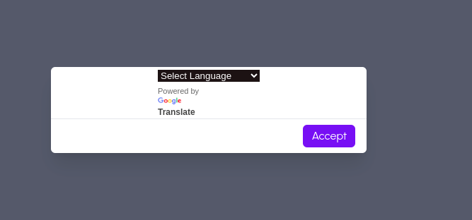

# All-Ed Education Platform

Welcome to **All-Ed**, your ultimate education companion that redefines learning. This comprehensive education platform is designed to enhance your academic journey through a variety of features and innovations.

## Features

### 1. Guidance Support
Our platform provides personalized guidance support, offering assistance tailored to your academic needs. Get the help you need to succeed.

### 2. Progress Tracking
Monitor your academic progress effortlessly. All-Ed keeps you informed about your achievements and areas for improvement.

### 3. EduBot Chatbot
Meet EduBot, your intelligent chatbot companion. Powered by Dialogflow API, EduBot is designed to assist and enhance your learning experience. It understands multiple languages, making communication seamless.

### 4. Multi-Linguistic Page
All-Ed is a multi-linguistic web application, allowing users to experience the entire platform in their preferred language. Choose from a variety of language options to make your learning environment more comfortable.

## Tech Stack

All-Ed is built using the following technologies:

- HTML
- CSS
- JavaScript
- Django
- Dialogflow API

## Screenshots

Here are some snapshots of the All-Ed web application:

- Insert screenshots here to showcase the user interface.

## Getting Started

To run All-Ed locally, follow these steps:

1. Clone the repository:

    ```bash
        git clone https://github.com/Mdwaseel/All-Ed/
    ```

2. Install dependencies:

    ```bash
    pip install -r requirements.txt
    ```

3. Run the development server:

    ```bash
    python manage.py runserver
    ```

4. Access All-Ed in your web browser at `http://localhost:8000`.


## Admin Credentials

To access the admin panel, use the following credentials:

- **Username:** mdwaseel
- **Password:** 1234


## Demo 




## Contribution

We welcome contributions to make All-Ed even better. If you have ideas for new features, improvements, or bug fixes, feel free to submit a pull request.

Happy Learning with All-Ed! 📚✨
